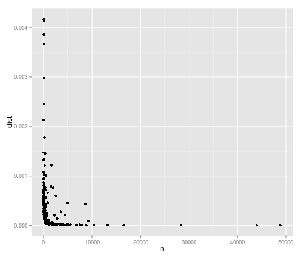
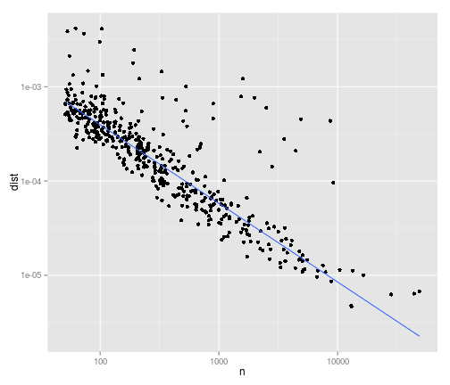

## Case study
========================================================

_Das ist eine Übung damit ich "tidy data" lerne._


First step is to load the libraries we need:


```r

library(reshape2)
library(ggplot2)
library(plyr)
library(stringr)
library(MASS)
library(ProjectTemplate)
library(Hmisc)
```

```
## Loading required package: grid
## Loading required package: lattice
## Loading required package: survival
## Loading required package: splines
## Loading required package: Formula
## 
## Attaching package: 'Hmisc'
## 
## The following objects are masked from 'package:plyr':
## 
##     is.discrete, summarize
## 
## The following objects are masked from 'package:base':
## 
##     format.pval, round.POSIXt, trunc.POSIXt, units
```

```r
library(knitr)
```


Ich benutze library(ProjectTemplate) um mein Project besser zu organisieren. 


```r
## create.project(CaseStudy)
setwd("~/CaseStudy/")
```

xtable.r in die Folgende directory. Dann habe ich die Package xtable installiert


```r
source("~/Documents/Doktorarbeit/xtable.r")
```

```
## 
## Attaching package: 'xtable'
## 
## The following objects are masked from 'package:Hmisc':
## 
##     label, label<-
```

Download .csv Datei von https://github.com/hadley/mexico-mortality/raw/master/deaths/deaths08.csv.bz2
and placed it in ~/CaseStudy


```r
setwd("~/CaseStudy/")
load.project()
```

```
## Loading project configuration
## Autoloading helper functions
##  Running helper script: helpers.R
## Autoloading packages
##  Loading package: reshape
## 
## Attaching package: 'reshape'
## 
## The following objects are masked from 'package:plyr':
## 
##     rename, round_any
## 
## The following objects are masked from 'package:reshape2':
## 
##     colsplit, melt, recast
## 
##  Loading package: plyr
##  Loading package: ggplot2
##  Loading package: stringr
##  Loading package: lubridate
## 
## Attaching package: 'lubridate'
## 
## The following object is masked from 'package:reshape':
## 
##     stamp
## 
## The following object is masked from 'package:plyr':
## 
##     here
## 
## Autoloading data
##  Loading data set: deaths08
## Loading required package: data.table
## 
## Attaching package: 'data.table'
## 
## The following objects are masked from 'package:lubridate':
## 
##     hour, mday, month, quarter, wday, week, yday, year
## 
## Converting data.frames to data.tables
##  Translating data.frame: deaths08
## Munging data
##  Running preprocessing script: 01-A.R
```

```r
deaths <- deaths08
```


Jetzt möchte ich mich mit den Totesfällen an bestimmten Tageszeiten beschäftigen.
Mit foglenden Befehlen kann ich die benötigten Beobachtungen aus dem gesamten Datensatz gewinnen.
 
 
Erzeugt ein dataset mit Hour Of Death + Cause Of Death + Number of Dead peaople in every hour 

```r

hod2 <- count(deaths, c("hod", "cod"))
```

 
Enfernt Not a Number aus hod Spalte


```r
hod2 <- subset(hod2, !is.na(hod))  # Enfernt Not a Number aus hod Spalte
```


Da die Totesursachen mit Code angezeigt werden wollen wir nun unsere hod2 Dateien mit einer Tabelle die diese Codes erklärt


```r
setwd("~/CaseStudy/")

codes <- read.csv("codes.csv")
```


DAS HABE ICH EINFACH ABGESCHRIEBEN ADRIAN BITTE ERKLÄREN

```r
codes$disease <- sapply(codes$disease, function(x) str_c(strwrap(x, width = 30), 
    collapse = "\n"))
names(codes)[1] <- "cod"
codes <- codes[!duplicated(codes$cod), ]
```


```r
hod2 <- join(hod2, codes, by = "cod")
```


Die ddply Funktion 


```r
hod2 <- ddply(hod2, "cod", transform, prop = freq/sum(freq))
overall <- ddply(hod2, "hod", summarise, freq_all = sum(freq))
overall <- transform(overall, prop_all = freq_all/sum(freq_all))
hod2 <- join(hod2, overall, by = "hod")


devi <- ddply(hod2, "cod", summarise, n = sum(freq), dist = mean((prop - prop_all)^2))
devi <- subset(devi, n > 50)
```


You can also embed plots, for example:


```r
ggplot(data = devi, aes(x = n, y = dist)) + geom_point()
```

 

```r
last_plot() + scale_x_log10() + scale_y_log10() + geom_smooth(method = "rlm", 
    se = F)
```

 


